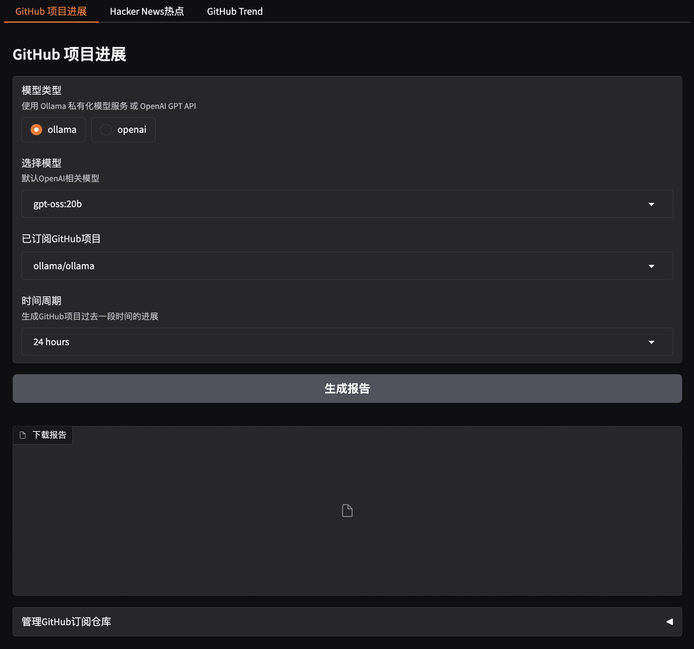
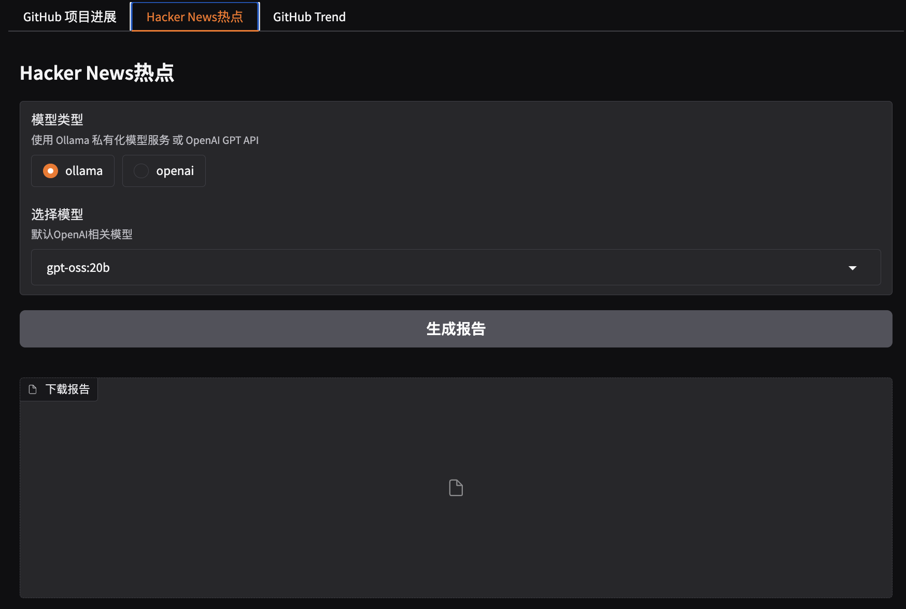
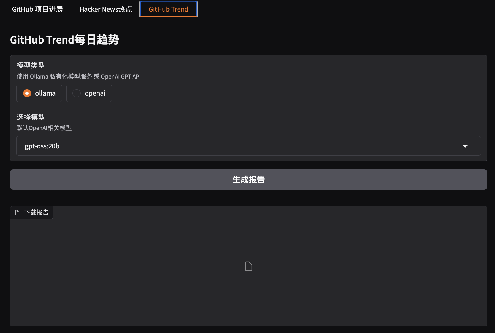
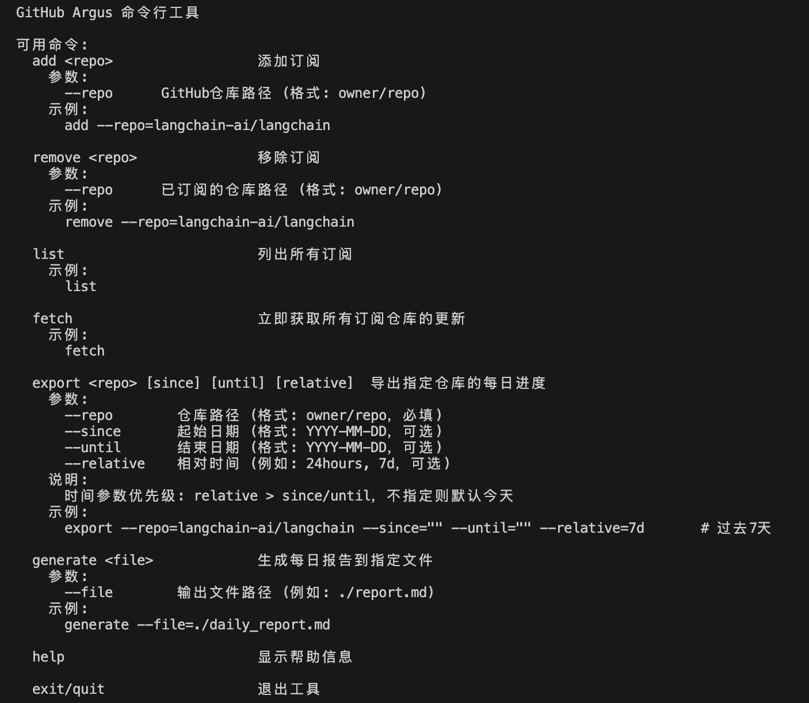

<h1 align="center">🛡️ TechSentry</h1>

<p align="center">
  <strong>面向开发者的技术情报采集与智能整理工具</strong><br/>
  自动追踪 GitHub 仓库动态 · Hacker News 热点 · GitHub Trending<br/>
  原始数据沉淀为 Markdown → LLM 生成中文摘要 → 邮件 / 企业微信推送
</p>

<p align="center">
  
  
  
  
</p>

---

## 📑 目录

- [功能亮点](#-功能亮点)
- [截图预览](#-截图预览)
- [适用场景](#-适用场景)
- [工作流概览](#-工作流概览)
- [快速开始](#-快速开始)
- [配置说明](#-配置说明)
- [运行方式](#-运行方式)
- [Docker 使用](#-docker-使用)
- [输出目录](#-输出目录)
- [定时任务调度](#-定时任务调度)
- [运行指标](#-运行指标)
- [项目结构](#-项目结构)
- [已知限制](#-已知限制)

---

## ✨ 功能亮点

| 功能模块 | 说明 |
|---------|------|
| **GitHub 仓库动态订阅** | 根据 `subscriptions.json` 抓取 Issue / PR 更新，导出原始 Markdown 并用 LLM 生成中文日报 |
| **Hacker News 热点采集** | 每 4 小时采集热门内容，生成小时报；每天汇总为日报总结 |
| **GitHub Trending 日报** | 抓取 GitHub Trending 日榜，自动生成中文趋势报告 |
| **多种运行入口** | 守护进程（长期运行）/ Web 界面（手动触发）/ CLI（脚本化操作）/ Docker |
| **通知推送** | 支持邮件通知、企业微信机器人推送 |
| **运行指标** | API 统计、任务 KPI、数据源健康度自动落盘 |

---

## 📸 截图预览

<table>
  <tr>
    <td align="center"><strong>GitHub 仓库进展</strong><br/></td>
    <td align="center"><strong>Hacker News 热点</strong><br/></td>
  </tr>
  <tr>
    <td align="center"><strong>GitHub Trending</strong><br/></td>
    <td align="center"><strong>交互式命令行</strong><br/></td>
  </tr>
</table>

---

## 🎯 适用场景

- **个人技术情报面板** — 每天自动关注重点仓库和技术热点
- **团队研发日报** — 把零散更新整理成统一输出
- **开源项目观察** — 长期跟踪某些仓库的迭代节奏
- **LLM 报告生成实验** — 把抓取、整理、总结串成完整链路

---

## 🔄 工作流概览

```text
GitHub / Hacker News / GitHub Trending
                ↓
          原始 Markdown 数据
                ↓
          LLM 生成总结报告
                ↓
    本地落盘 / 邮件 / 企业微信通知
```

---

## 🚀 快速开始

### 1. 克隆项目

```bash
git clone <your-repo-url>
cd TechSentry
```

### 2. 安装依赖

```bash
pip install -r requirements.txt
```

### 3. 准备环境变量

```bash
cp .env.example .env
```

最少需要配置：

```bash
GITHUB_TOKEN=your-github-token
```

如需使用 OpenAI 兼容接口生成摘要，建议同时配置：

```bash
LLM_API_TOKEN=your-llm-api-token
LLM_BASE_URL=http://your-openai-compatible-endpoint
```

### 4. 启动守护进程

```bash
python src/daemon_process.py
```

启动后所有业务任务将由 APScheduler 按计划时间自动调度执行。

---

## ⚙️ 配置说明

项目配置由 `config.json` 和 `.env` 两部分组成。

### `config.json`

```json
{
  "subscriptions_file": "subscriptions.json",
  "update_frequency_days": 1,
  "update_execution_time": "17:00",
  "llm": {
    "model_type": "openai",
    "openai_model_name": "gpt-5-mini",
    "ollama_model_name": "gpt-oss:20b",
    "ollama_api_url": "http://localhost:11434/v1"
  },
  "report_types": [
    "github",
    "hack_news_hours",
    "hack_news_daily",
    "github_trend_daily"
  ]
}
```

| 字段 | 说明 |
|------|------|
| `subscriptions_file` | 订阅仓库列表文件路径 |
| `update_frequency_days` | GitHub 更新周期天数 |
| `update_execution_time` | GitHub 仓库任务的执行时间，格式 `HH:MM` |
| `llm.model_type` | `openai` 或 `ollama` |
| `llm.openai_model_name` | OpenAI 模型名 |
| `llm.ollama_model_name` | Ollama 模型名 |
| `llm.ollama_api_url` | Ollama API 地址 |
| `report_types` | 启动时预加载的提示词类型，需与 `prompts/` 中的模板对应 |

### `.env`

参考 `.env.example`，按需配置以下环境变量：

| 变量 | 用途 | 必填 |
|------|------|:----:|
| `GITHUB_TOKEN` | GitHub API 访问令牌 | ✅ |
| `LLM_API_TOKEN` | OpenAI 兼容接口的 API Token | 使用 OpenAI 时 |
| `LLM_BASE_URL` | OpenAI 兼容接口的 Base URL | 使用 OpenAI 时 |
| `EMAIL_SMTP_SERVER` | SMTP 服务器地址 | 使用邮件通知时 |
| `EMAIL_SMTP_PORT` | SMTP 端口 | 使用邮件通知时 |
| `EMAIL_FROM` | 发件人邮箱 | 使用邮件通知时 |
| `EMAIL_TO` | 收件人邮箱 | 使用邮件通知时 |
| `GMAIL_SPECIAL_PASSWORD` | Gmail 应用专用密码 | 使用 Gmail 时 |
| `WX_WEBHOOK_URL` | 企业微信机器人 Webhook URL | 使用企微通知时 |

> **说明**：
> - `model_type=openai` 实际使用的是 `LLM_API_TOKEN` 和 `LLM_BASE_URL`
> - `model_type=ollama` 时，本地运行使用 `config.json` 中的 `ollama_api_url`；容器内运行自动切换到 `http://host.docker.internal:11434/v1`

---

## 🖥️ 运行方式

### 1. 守护进程

```bash
python src/daemon_process.py
```

启动后会初始化配置、订阅、通知器与 LLM，启动 APScheduler 并注册所有定时任务，保持进程常驻。

### 2. 后台脚本管理

项目提供了 `daemon.sh` 用于后台启动和管理：

```bash
chmod +x daemon.sh

./daemon.sh start     # 启动
./daemon.sh stop      # 停止
./daemon.sh restart   # 重启
./daemon.sh status    # 查看状态
./daemon.sh logs      # 查看日志
./daemon.sh help      # 帮助
```

> **注意**：脚本默认使用 `./venv/bin/python3`。如果实际使用 `.venv`，建议直接手动执行或调整脚本中的 `VENV_DIR`。

### 3. Web 界面

```bash
python src/gradio_server.py
```

默认监听 `0.0.0.0:7860`，浏览器访问 `http://localhost:7860`。

界面包含 3 个标签页：

| 标签页 | 功能 |
|-------|------|
| **GitHub 项目进展** | 选择订阅仓库和时间范围，生成报告，管理订阅 |
| **Hacker News 热点** | 生成当日 Hacker News 报告 |
| **GitHub Trend** | 生成 GitHub Trending 日报 |

> **注意**：页面中的模型类型和模型名称选项当前**不会覆盖后端配置**，实际使用的模型以 `config.json` 为准。

### 4. 交互式 CLI

```bash
python src/command_tool.py
```

启动后进入 `Tech Sentry>` 提示符，支持以下命令：

```bash
# 订阅管理
add --repo=langchain-ai/langchain       # 添加订阅
remove --repo=langchain-ai/langchain    # 删除订阅
list                                     # 查看订阅列表

# 数据操作
fetch                                    # 拉取全部订阅更新

# 导出仓库进展（二选一）
export --repo=langchain-ai/langchain --relative=7d
export --repo=langchain-ai/langchain --since=2026-03-10 --until=2026-03-18

# 基于已有 Markdown 文件生成 LLM 报告
generate --file=./daily_report.md

# 其他
help / exit / quit
```

> **说明**：
> - `export` 中 `relative` 优先级高于 `since/until`，输出目录为 `daily_progress/<owner>/<repo>/`
> - `generate --file` 接收的是**已有的原始 Markdown 输入文件路径**，不是输出路径

---

## 🐳 Docker 使用

### 构建镜像

```bash
# 使用构建脚本（自动读取 Git 分支名作为 tag）
chmod +x build-docker.sh
./build-docker.sh

# 或直接构建
docker build -t github_argus:local .
```

### 运行镜像

```bash
# 使用运行脚本
chmod +x run-docker.sh
./run-docker.sh          # 默认 tag
./run-docker.sh v0.7     # 指定 tag
```

运行脚本会自动注入 `GITHUB_TOKEN`，可选注入 `GMAIL_SPECIAL_PASSWORD` 与 `OPENAI_API_KEY`，并添加 `host.docker.internal:host-gateway` 以支持容器访问宿主机 Ollama。

> 容器默认入口为 `python src/daemon_process.py`（守护进程模式）。

---

## 📂 输出目录

| 类型 | 路径格式 | 示例 |
|------|---------|------|
| GitHub 仓库原始进展 | `daily_progress/<owner>/<repo>/<since>_<until>.md` | `daily_progress/langchain-ai/langchain/2026-03-11_2026-03-18.md` |
| GitHub 仓库 LLM 报告 | `daily_progress/<owner>/<repo>/*_report.md` | — |
| HN 小时级原始数据 | `hacker_news/<YYYY-MM-DD>/<HH>.md` | — |
| HN 小时报告 | `hacker_news/<YYYY-MM-DD>/<HH>_report.md` | — |
| HN 日报原始文件 | `hacker_news/tech_trend/<YYYY-MM-DD>.md` | — |
| HN 日报总结 | `hacker_news/tech_trend/<YYYY-MM-DD>_report.md` | — |
| GitHub Trending 原始 | `github_trend/<YYYY-MM-DD>.md` | — |
| GitHub Trending 报告 | `github_trend/<YYYY-MM-DD>_report.md` | — |

### 日志目录

| 文件 | 说明 |
|------|------|
| `logs/app.log` | 应用运行日志 |
| `logs/llm.log` | LLM 调用日志 |
| `logs/api_stats.log` | API 调用统计 |
| `logs/job_kpi.log` | 任务 KPI |
| `logs/source_health.log` | 数据源健康度 |
| `logs/DaemonProcess.log` | `daemon.sh` 启动时的输出日志 |
| `logs/DaemonProcess.pid` | `daemon.sh` 启动时的 PID 文件 |

---

## ⏱️ 定时任务调度

启动 `src/daemon_process.py` 后，**不会立即执行业务任务**，所有任务均由 APScheduler 按计划时间调度触发。

| 任务 | 调度方式 | 执行时间 | 说明 |
|------|---------|---------|------|
| 清理历史报告目录 | cron | 每天 `00:00` | 清理过期的报告文件 |
| API 调用统计落盘 | cron | 每天 `00:05` | 写入 `logs/api_stats.log` |
| 任务 KPI / 数据源健康度落盘 | cron | 每天 `00:06` | 写入 `logs/job_kpi.log`、`logs/source_health.log` |
| GitHub 仓库进展报告 | interval | 每 N 天，在 `update_execution_time` 指定的时间 | 采集订阅仓库更新并生成报告、发送通知 |
| Hacker News 小时级热点 | cron | 每 4 小时第 10 分钟（`0:10`、`4:10`、`8:10`…） | 采集最新热门内容并生成小时报 |
| Hacker News 每日热点 | cron | 每天 `20:30` | 汇总生成日报并发送通知 |
| GitHub Trending 日报 | cron | 每天 `18:00` | 采集趋势榜并生成日报、发送通知 |

> 所有业务任务均设置了 `max_instances=1`（防止重叠执行）、`coalesce=True`（合并错过的执行）以及合理的 `misfire_grace_time`。

---

## 📊 运行指标

守护进程会在每天 `00:05` / `00:06` 自动落盘以下运行指标：

- **任务成功率**：`success_runs / total_runs`
- **任务准点率**：按计划触发时间偏差统计
- **任务耗时 P95**
- **采集成功率** / **报告生成成功率** / **通知发送成功率**
- **数据新鲜度**

---

## 🗂️ 项目结构

```text
TechSentry/
├── config.json              # 项目配置
├── subscriptions.json       # 订阅仓库列表
├── .env                     # 环境变量（需自行创建）
├── daemon.sh                # 后台脚本管理
├── build-docker.sh          # Docker 构建脚本
├── run-docker.sh            # Docker 运行脚本
├── requirements.txt         # Python 依赖
├── Dockerfile
├── prompts/                 # LLM 提示词模板
├── screenshot/              # 截图资源
├── logs/                    # 日志输出
├── daily_progress/          # GitHub 仓库进展输出
├── github_trend/            # GitHub Trending 输出
├── hacker_news/             # Hacker News 输出
├── src/
│   ├── daemon_process.py    # 守护进程主程序
│   ├── gradio_server.py     # Web 界面
│   ├── command_tool.py      # 交互式 CLI
│   ├── config.py            # 配置加载
│   ├── github_api.py        # GitHub API 封装
│   ├── github_trend_api.py  # GitHub Trending 采集
│   ├── hackernews_api.py    # Hacker News 采集
│   ├── llm.py               # LLM 调用封装
│   ├── report_generator.py  # 报告生成器
│   ├── notifier.py          # 通知发送
│   ├── subscription.py      # 订阅管理
│   ├── cleanup_reports.py   # 报告清理
│   ├── logger.py            # 日志配置
│   ├── utils.py             # 工具函数
│   └── command/             # CLI 命令模块
└── tests/                   # 测试
```

---

## ⚠️ 已知限制

| 问题 | 说明 |
|------|------|
| Gradio 模型选择仅为界面层 | 不会覆盖 `config.json` 中的模型设置 |
| CLI `generate --file` 语义 | 接收的是输入 Markdown 文件路径，不是输出路径 |
| 通知无细粒度开关 | 进入通知逻辑后会同时尝试邮件和企微，缺少独立开关 |
| `daemon.sh` 默认用 `./venv` | 如实际环境为 `.venv`，需自行调整 `VENV_DIR` |

---

## 📄 License

本项目采用 [MIT License](LICENSE)。
